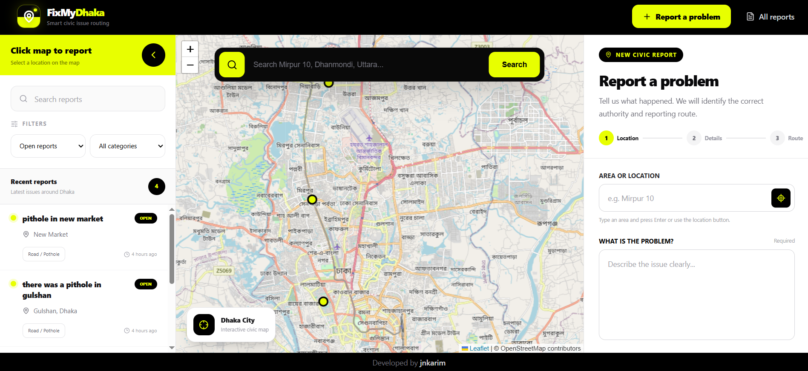

<div align="center">

# 📍 FixMyDhaka

### Smart Civic Issue Routing for Dhaka

**Report a civic problem → Find the responsible authority → Get evidence → Take the right next step**

<br />



<br />
<br />


<br />

**FixMyDhaka helps citizens understand where a civic complaint should go without requiring them to understand complex government authority structures.**

</div>

---

## ✦ Overview

**FixMyDhaka** is an AI-assisted civic issue routing platform designed for Dhaka.

Citizens usually know what the problem is:

> "There is a pothole on this road."

> "Garbage has been blocking the footpath."

> "There has been no water supply for three days."

But they may not know:

- which authority is responsible
- whether the area belongs to DNCC or DSCC
- whether the issue should instead go to DWASA
- where the official complaint channel is
- how to write a clear formal complaint

FixMyDhaka simplifies this process.

```text
Complaint
    ↓
Location
    ↓
AI Issue Classification
    ↓
Jurisdiction Resolution
    ↓
Authority Evidence Retrieval
    ↓
Responsible Authority
    ↓
Prepared Complaint
    ↓
Official Reporting Route
```

---

## ✦ Core Idea

> **Complaint → Correct Authority → Evidence → Actionable Next Step**

FixMyDhaka is not designed to pretend that it is an official government ticketing platform.

Instead, it acts as an intelligent routing layer between the citizen and the appropriate authority.

---

## ✦ Why FixMyDhaka?

Civic services in Dhaka are distributed across multiple organizations.

For example:

```text
Road / Pothole
→ DNCC or DSCC

Garbage
→ DNCC or DSCC

Streetlight
→ DNCC or DSCC

Water Supply
→ DWASA

Sewerage
→ DWASA
```

A location can belong to one jurisdiction while the actual service responsibility belongs to another authority.

Example:

```text
Location
→ Gulshan

Jurisdiction
→ DNCC

Problem
→ No water supply

Responsible Authority
→ DWASA
```

This distinction is one of the core ideas behind FixMyDhaka.

---

# ✦ Features

## 🗺️ Interactive Map Reporting

Users can select the location of a civic problem directly from the map.

The map supports:

- map click selection
- area search
- automatic map movement
- reverse geocoding
- synchronized report location
- selected location marker
- public civic report markers

Built using:

- Leaflet
- React Leaflet
- OpenStreetMap

---

## 🔎 Location Search

Users can search locations such as:

```text
Mirpur 10
Dhanmondi
Gulshan
Uttara
Khilgaon
New Market
```

The application resolves the selected result into:

```text
Latitude
Longitude
Readable Area Name
```

and automatically moves the map to that location.

---

## ✨ AI Issue Classification

FixMyDhaka uses **Gemini** to understand a complaint written in natural language.

Supported categories include:

```text
Road / Pothole
Garbage
Streetlight
Waterlogging / Drainage
Water / Sewerage
Public Safety
Unclear
```

Example:

```text
"There is a large hole in the middle of the road."

        ↓

Road / Pothole
```

---

## 📸 Visual Evidence

Users can optionally attach an image with their report.

Supported formats:

```text
JPEG
PNG
WebP
```

The image can help provide additional context during issue analysis.

---

## 📍 Jurisdiction Resolution

FixMyDhaka determines which city corporation jurisdiction an area belongs to.

Examples:

```text
Mirpur
→ DNCC

Gulshan
→ DNCC

Dhanmondi
→ DSCC

Khilgaon
→ DSCC
```

The system intentionally keeps:

```text
Jurisdiction
```

and:

```text
Responsible Authority
```

as separate concepts.

---

## 🧠 Agentic Workflow

The backend uses **LangGraph** to coordinate the report analysis pipeline.

```text
START
  │
  ▼
Validate Location
  │
  ▼
Classify Issue
  │
  ▼
Resolve Jurisdiction
  │
  ▼
Retrieve Authority Evidence
  │
  ▼
Determine Responsible Authority
  │
  ▼
Build Reporting Route
  │
  ▼
END
```

Each stage has a specific responsibility.

---

## 📚 RAG-Based Authority Resolution

FixMyDhaka uses **Retrieval-Augmented Generation (RAG)** to support routing decisions with authority documents.

Instead of relying only on an AI prediction:

```text
Issue
   ↓
Category
   ↓
Jurisdiction
   ↓
Vector Search
   ↓
Official Authority Documents
   ↓
Relevant Evidence
   ↓
Authority Decision
```

The RAG system uses:

- Hugging Face embeddings
- Chroma vector database
- authority service documents
- metadata-based filtering

---

## 🏛️ Supported Authorities

The current system supports routing between:

### DNCC

**Dhaka North City Corporation**

Used for relevant civic services within the Dhaka North jurisdiction.

---

### DSCC

**Dhaka South City Corporation**

Used for relevant civic services within the Dhaka South jurisdiction.

---

### DWASA

**Dhaka Water Supply and Sewerage Authority**

Used primarily for relevant:

- water supply
- sewerage
- utility-related issues

---

## 📝 Prepared Complaint Generation

After identifying the authority, FixMyDhaka generates a structured complaint for the user.

A complaint may include:

```text
Subject
Authority
Issue Description
Location
Category
Visual Evidence
Requested Action
```

The user can then copy the complaint and continue to the appropriate official reporting channel.

---

## 🔗 Official Reporting Handoff

FixMyDhaka keeps its own civic report record separate from official government complaint submission.

```text
FixMyDhaka Report
        ↓
Authority Identification
        ↓
Prepared Complaint
        ↓
Official Government Form / Channel
        ↓
User Submits Externally
```

This prevents the platform from falsely claiming that an official government complaint was submitted.

---

## 📊 Public Civic Reports

Reports saved through FixMyDhaka can be viewed through the public report registry.

Users can:

- search reports
- filter reports
- browse categories
- view report status
- see responsible authorities
- view report locations
- see official submission status

# ✦ System Architecture

```text
                         ┌──────────────────────┐
                         │                      │
                         │    React Frontend    │
                         │                      │
                         │  Vite + TailwindCSS  │
                         │                      │
                         └──────────┬───────────┘
                                    │
                                    │
                                 REST API
                                    │
                                    ▼
                         ┌──────────────────────┐
                         │                      │
                         │       FastAPI        │
                         │                      │
                         └──────────┬───────────┘
                                    │
                                    ▼
                         ┌──────────────────────┐
                         │                      │
                         │      LangGraph       │
                         │                      │
                         │   Agentic Workflow   │
                         │                      │
                         └──────────┬───────────┘
                                    │
                 ┌──────────────────┼──────────────────┐
                 │                  │                  │
                 ▼                  ▼                  ▼
        ┌────────────────┐  ┌────────────────┐  ┌────────────────┐
        │                │  │                │  │                │
        │     Gemini     │  │ Jurisdiction   │  │      RAG       │
        │                │  │    Resolver    │  │   Retrieval    │
        │ Classification │  │                │  │                │
        └────────────────┘  └────────────────┘  └───────┬────────┘
                                                        │
                                                        ▼
                                               ┌─────────────────┐
                                               │                 │
                                               │     Chroma      │
                                               │                 │
                                               │   Vector DB     │
                                               │                 │
                                               └────────┬────────┘
                                                        │
                                                        ▼
                                               Authority Documents
                                                        │
                                                        ▼
                                               Responsibility Evidence
                                                        │
                                                        ▼
                                                Reporting Route
```

---

# ✦ Tech Stack

## Frontend

| Technology    | Purpose                |
| ------------- | ---------------------- |
| React         | User interface         |
| Vite          | Frontend build tooling |
| Tailwind CSS  | Styling                |
| React Router  | Application routing    |
| React Leaflet | Interactive maps       |
| Leaflet       | Map engine             |
| OpenStreetMap | Map data               |
| Lucide React  | Interface icons        |

---

## Backend

| Technology | Purpose                         |
| ---------- | ------------------------------- |
| Python     | Backend runtime                 |
| FastAPI    | REST API                        |
| LangGraph  | Agentic workflow                |
| Gemini     | AI issue classification         |
| SQLite     | Civic report persistence        |
| Pydantic   | Request and response validation |

---

## RAG Pipeline

| Technology              | Purpose                              |
| ----------------------- | ------------------------------------ |
| Hugging Face Embeddings | Document embeddings                  |
| Sentence Transformers   | Multilingual semantic representation |
| Chroma                  | Vector database                      |
| RAG                     | Evidence retrieval                   |
| Authority Documents     | Responsibility knowledge base        |

# ✦ Getting Started

## 1. Clone the Repository

```bash
git clone https://github.com/jnkarim/FixMyDhaka.git
```

```bash
cd FixMyDhaka
```

---

# ✦ Backend Setup

Move to the backend directory:

```bash
cd server
```

Create a Python virtual environment:

```bash
python -m venv .venv
```

### Windows

```powershell
.\.venv\Scripts\Activate.ps1
```

### Linux / macOS

```bash
source .venv/bin/activate
```

Install dependencies:

```bash
pip install -r requirements.txt
```

---

## Environment Variables

Create:

```text
server/.env
```

Example:

```env
GOOGLE_API_KEY=your_google_api_key
FRONTEND_URL=http://localhost:5173
```

Do not commit your real API keys.

---

## Run the Backend

```bash
uvicorn app.main:app --reload
```

Backend URL:

```text
http://127.0.0.1:8000
```

Health check:

```text
http://127.0.0.1:8000/health
```

Swagger API documentation:

```text
http://127.0.0.1:8000/docs
```

---

# ✦ Frontend Setup

Open another terminal.

Move to the frontend:

```bash
cd client
```

Install dependencies:

```bash
npm install
```

Create:

```text
client/.env
```

Add:

```env
VITE_API_BASE_URL=http://127.0.0.1:8000
```

Start the development server:

```bash
npm run dev
```

Frontend URL:

```text
http://localhost:5173
```

---

# ✦ Environment Variables

## Frontend

| Variable            | Description         |
| ------------------- | ------------------- |
| `VITE_API_BASE_URL` | FastAPI backend URL |

Example:

```env
VITE_API_BASE_URL=http://127.0.0.1:8000
```

---

## Backend

| Variable           | Description                               |
| ------------------ | ----------------------------------------- |
| `GOOGLE_API_KEY`   | Gemini API key                            |
| `FRONTEND_URL`     | Allowed frontend origin                   |
| `PYTHONUNBUFFERED` | Optional production logging configuration |

Example:

```env
GOOGLE_API_KEY=your_google_api_key
FRONTEND_URL=http://localhost:5173
PYTHONUNBUFFERED=1
```

---

# ✦ API Endpoints

## Health Check

```http
GET /health
```

Example response:

```json
{
  "status": "ok"
}
```

---

## Analyze and Create Report

```http
POST /api/reports/analyze
```

Form data:

```text
description
location
latitude
longitude
photo
```

---

## Get All Reports

```http
GET /api/reports
```

---

## Get a Report

```http
GET /api/reports/{report_id}
```

---

## Update a Report

```http
PATCH /api/reports/{report_id}
```

Example:

```json
{
  "official_submission_status": "Submitted externally"
}
```

---

# ✦ RAG Knowledge Base

Authority documents are stored inside:

```text
server/app/data/authority_docs/
```

Current knowledge sources include:

```text
dncc_services.txt
dscc_services.txt
dwasa_services.txt
```

The Chroma vector database is stored inside:

```text
server/app/data/authority_vectorstore/
```

The retrieval pipeline uses these documents to find relevant evidence for authority routing.

---

# ✦ Example Workflow

Suppose a citizen reports:

```text
There is a large pothole on the main road in Gulshan.
```

FixMyDhaka processes the report like this:

```text
User Description
        ↓
"There is a large pothole..."

        ↓

AI Classification
        ↓
Road / Pothole

        ↓

Location
        ↓
Gulshan

        ↓

Jurisdiction Resolution
        ↓
DNCC

        ↓

RAG Search
        ↓
Official Responsibility Evidence

        ↓

Authority
        ↓
DNCC

        ↓

Prepared Complaint
        ↓
Generated automatically

        ↓

Official Reporting Route
```

---

Another example:

```text
Location:
Mirpur

Problem:
There has been no water supply for three days.
```

The result can be:

```text
Jurisdiction
→ DNCC

Issue Category
→ Water / Sewerage

Responsible Authority
→ DWASA
```

This demonstrates one of the core concepts of the system:

> **Jurisdiction and responsible authority are not always the same.**

---

# ✦ Data Flow

```text
User
 │
 │ selects location
 │ enters description
 │ uploads optional photo
 │
 ▼
React Frontend
 │
 │ multipart/form-data
 │
 ▼
FastAPI
 │
 ▼
LangGraph
 │
 ├──────────────► Location Validation
 │
 ├──────────────► Gemini Classification
 │
 ├──────────────► Jurisdiction Resolution
 │
 └──────────────► RAG Authority Retrieval
                         │
                         ▼
                    Chroma DB
                         │
                         ▼
                 Authority Evidence
                         │
                         ▼
                 Reporting Action Plan
                         │
                         ▼
                    SQLite Report
                         │
                         ▼
                  React Result Panel
```

````

# ✦ Important Design Principle

FixMyDhaka distinguishes between:

### Reported to FixMyDhaka

and

### Officially submitted to a government authority

These are not treated as the same event.

A FixMyDhaka report means the issue has been:

```text
Recorded
Classified
Routed
Prepared
````

It does not automatically mean the complaint has been officially submitted to a government organization.

---

# ✦ Current Scope

FixMyDhaka currently provides:

```text
✓ Map based civic issue reporting

✓ Area search and reverse geocoding

✓ AI issue classification

✓ DNCC / DSCC jurisdiction resolution

✓ DWASA service routing

✓ RAG based responsibility evidence

✓ Formal complaint generation

✓ Official reporting route

✓ Public civic report registry

✓ Status tracking

✓ Optional image evidence

✓ Responsive interface
```

---

# ✦ Future Roadmap

Potential future improvements include:

### Geospatial

- polygon based jurisdiction detection
- ward level detection
- zone level routing
- authority service boundaries

### Reporting

- duplicate issue detection
- report detail pages
- civic issue timelines
- community updates
- official tracking number storage

### Intelligence

- Bangla first issue reporting
- Banglish understanding
- multilingual complaint generation
- improved authority retrieval
- more civic authorities

### Community

- follow a report
- local issue alerts
- community confirmations
- resolved issue verification

### Infrastructure

- PostgreSQL
- persistent media storage
- production monitoring
- improved caching
- background processing

---

# ✦ Design Philosophy

## 01 — Simple for Citizens

Citizens should describe the problem.

They should not need to understand complex administrative structures.

---

## 02 — Evidence Over Guessing

Authority routing should be supported by retrievable responsibility information whenever possible.

---

## 03 — Transparent Routing

The user should be able to understand:

```text
What happened?
Where did it happen?
Who is responsible?
Why are they responsible?
What should I do next?
```

---

## 04 — Honest Submission Status

FixMyDhaka should never imply that an official government complaint was submitted unless the user actually completed that process.

---

# ✦ Disclaimer

FixMyDhaka is an independent civic technology project.

It is **not an official website or service of DNCC, DSCC, DWASA, or any other government organization**.

Authority information and reporting routes are provided to help users navigate civic services.

Official complaint submission may take place through external authority-operated or government-operated platforms.

---

---

# ✦ Author

<div align="center">

Built and developed by

## [jnkarim](https://github.com/jnkarim)


⭐ If you find this project useful, consider starring the repository.

</div>
